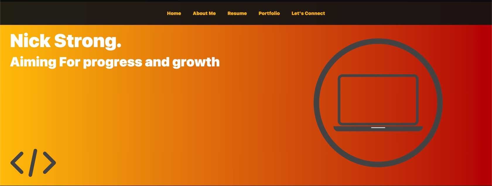

# React-Portfolio-2021

[Deployed Site](https://strong-one.github.io/React-Portfolio-2021/)

## Description

Every devloper needs a portfolio page that will showcase thier projects and work to potential emloyers or customers.

This portfolio is constructed with react, react made construction of this page very clear and concise, It is understandable how many companies are using this library. It makes rendering information to the user much more efficient and really hits the DRY technique home

## How to Contribute

The best way to contribute is by feedback, what could I have done better? What different design choices could I have made? How can the code be more consice? What did I do well? Any constructive critisism helps in alot of ways!

## Credits

[Pixabay](https://pixabay.com/)
[CSS Gradient](https://cssgradient.io/)
[UI Gradients](https://uigradients.com/#Kyoto)
[Coolors](https://coolors.co/)
[React Icons](https://react-icons.github.io/react-icons)
[React Bootstrap](https://react-bootstrap.github.io/)
